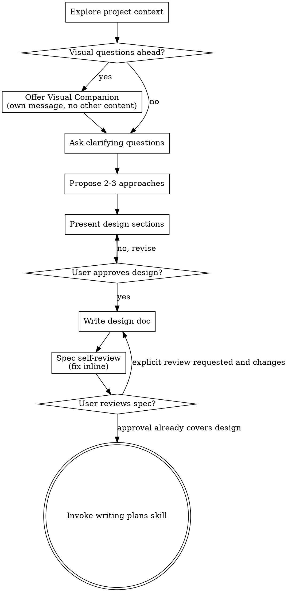

# Brainstorming Ideas Into Designs

Help turn ambiguous or consequential ideas into a proportionate design. Start by understanding the
current project context, ask only questions that can change the result, then present one coherent
recommendation. A clearly specified or user-authorized implementation does not need a formal design
approval loop.

<GATE>
Use a design conversation before implementation when requirements are ambiguous, the change is
substantial, multiple designs have meaningful trade-offs, or the user asks for a design. Do not
block a clearly specified L0/L1 task, a focused bug fix, a documentation/configuration edit, or a
mechanical change on a formal design approval.
</GATE>

## Scope Calibration

Small work still benefits from a one-sentence intent check when an assumption could change the
result. That is not the same as requiring a full specification. Use the smallest design artifact
that makes the decision auditable: a sentence for a focused change, a short proposal for a small
feature, and a full spec only for substantial or ambiguous work.

## Checklist

For substantial or ambiguous work, use the following checklist. For small work, collapse it to the
minimum items that affect the decision:

1. **Explore project context** — check files, docs, recent commits
2. **Offer visual companion** (if topic will involve visual questions) — this is its own message, not combined with a clarifying question. See the Visual Companion section below.
3. **Ask clarifying questions** — one at a time, understand purpose/constraints/success criteria
4. **Propose 2-3 approaches** — only when the choice is consequential, with trade-offs and your recommendation
5. **Present design** — in sections scaled to their complexity; seek one approval for the coherent design, not after every section
6. **Write design doc when warranted** — save it to the workspace-appropriate spec location described below; do not create ceremony for a one-file change
7. **Spec self-review** — quick inline check for placeholders, contradictions, ambiguity, scope (see below)
8. **User reviews written spec only when explicitly requested or when approval would change an external/irreversible decision**
9. **Transition to implementation** — invoke writing-plans skill to create implementation plan

## Process Flow

After the design is settled, choose the next workflow by task level. Use writing-plans for genuine
multi-step work; do not treat it as a mandatory terminal state for a small or direct change.

## The Process

**Understanding the idea:**

- Check out the current project state first (files, docs, recent commits)
- Before asking detailed questions, assess scope: if the request describes multiple independent subsystems (e.g., "build a platform with chat, file storage, billing, and analytics"), flag this immediately. Don't spend questions refining details of a project that needs to be decomposed first.
- If the project is too large for a single spec, help the user decompose into sub-projects: what are the independent pieces, how do they relate, what order should they be built? Then brainstorm the first sub-project through the normal design flow. Each sub-project gets its own spec → plan → implementation cycle.
- For appropriately-scoped projects, ask questions one at a time to refine the idea
- Prefer multiple choice questions when possible, but open-ended is fine too
- Ask only the questions that can change the implementation; use one at a time when the request is genuinely ambiguous.
- Focus on understanding: purpose, constraints, success criteria

**Exploring approaches:**

- Propose 2-3 different approaches with trade-offs
- Present options conversationally with your recommendation and reasoning
- Lead with your recommended option and explain why

**Presenting the design:**

- Once you believe you understand what you're building, present the design
- Scale each section to its complexity: a few sentences if straightforward, up to 200-300 words if nuanced
- For substantial work, ask once whether the coherent design is approved; do not ask after each section
- Cover: architecture, components, data flow, error handling, testing
- Be ready to go back and clarify if something doesn't make sense

**Design for isolation and clarity:**

- Break the system into smaller units that each have one clear purpose, communicate through well-defined interfaces, and can be understood and tested independently
- For each unit, you should be able to answer: what does it do, how do you use it, and what does it depend on?
- Can someone understand what a unit does without reading its internals? Can you change the internals without breaking consumers? If not, the boundaries need work.
- Smaller, well-bounded units are also easier for you to work with - you reason better about code you can hold in context at once, and your edits are more reliable when files are focused. When a file grows large, that's often a signal that it's doing too much.

**Working in existing codebases:**

- Explore the current structure before proposing changes. Follow existing patterns.
- Where existing code has problems that affect the work (e.g., a file that's grown too large, unclear boundaries, tangled responsibilities), include targeted improvements as part of the design - the way a good developer improves code they're working in.
- Don't propose unrelated refactoring. Stay focused on what serves the current goal.

## After the Design

**Documentation:**

- Write the validated design (spec):
  - When working anywhere under `/opt/homebrew/var/www/yesgooo/nzERP/`, save to `/opt/homebrew/var/www/yesgooo/nzERP/docs/superpowers/specs/YYYY-MM-DD-<topic>-design.md`. Do not create spec files in a child repository such as `service/docs/`, `backend/docs/`, `front/docs/`, or `base/docs/`.
  - In other workspaces, save to `docs/superpowers/specs/YYYY-MM-DD-<topic>-design.md`.
  - User preferences for spec location override these defaults.
- Use elements-of-style:writing-clearly-and-concisely skill if available
- Do not commit, push, or open a PR solely because a design document was written; those are separate
  user- or project-authorized actions.

**Spec Self-Review:**
After writing the spec document, look at it with fresh eyes:

1. **Placeholder scan:** Any "TBD", "TODO", incomplete sections, or vague requirements? Fix them.
2. **Internal consistency:** Do any sections contradict each other? Does the architecture match the feature descriptions?
3. **Scope check:** Is this focused enough for a single implementation plan, or does it need decomposition?
4. **Ambiguity check:** Could any requirement be interpreted two different ways? If so, pick one and make it explicit.

Fix any issues inline. No need to re-review — just fix and move on.

**User Review Gate:**
For substantial or explicitly design-driven work, present the coherent design and ask for one approval
before implementation. Design approval only authorizes the design choice; it never authorizes a
separate destructive, production, database-write, restart, or external-send action. Those actions keep
their own safety gate, but do not require re-approving the design:

> "Proposed design is `<path>`. Approve it, or tell me what to change before implementation."

Wait only when the decision is material or the user explicitly requested review. If they request
changes, revise the design once and continue; for a small, clearly specified change, record the
lightweight decision and proceed. A user request to implement the described design counts as approval
unless the implementation would change the stated goal, risk, or external impact.

**Implementation:**

- Invoke writing-plans for genuine multi-step work.
- For a focused change, continue with the smallest applicable domain, testing, and verification workflow.
- Do not suppress an otherwise relevant safety or diagnostic skill merely because brainstorming was used.

## Key Principles

- **One question at a time** - Don't overwhelm with multiple questions
- **Multiple choice preferred** - Easier to answer than open-ended when possible
- **YAGNI ruthlessly** - Remove unnecessary features from all designs
- **Explore alternatives** - Propose 2-3 approaches when the choice is consequential; do not manufacture options for a direct change
- **Incremental validation** - Validate material decisions once; do not turn each section into a separate gate
- **Be flexible** - Go back and clarify when something doesn't make sense

## Visual Companion

A browser-based companion for showing mockups, diagrams, and visual options during brainstorming. Available as a tool — not a mode. Accepting the companion means it's available for questions that benefit from visual treatment; it does NOT mean every question goes through the browser.

**Offering the companion:** When you anticipate that upcoming questions will involve visual content (mockups, layouts, diagrams), offer it once for consent:
> "Some of what we're working on might be easier to explain if I can show it to you in a web browser. I can put together mockups, diagrams, comparisons, and other visuals as we go. This feature is still new and can be token-intensive. Want to try it? (Requires opening a local URL)"

When a visual companion would materially help, offer it separately from clarifying questions. If the
user declines or the work is not visual, proceed with text-only brainstorming.

**Per-question decision:** Even after the user accepts, decide FOR EACH QUESTION whether to use the browser or the terminal. The test: **would the user understand this better by seeing it than reading it?**

- **Use the browser** for content that IS visual — mockups, wireframes, layout comparisons, architecture diagrams, side-by-side visual designs
- **Use the terminal** for content that is text — requirements questions, conceptual choices, tradeoff lists, A/B/C/D text options, scope decisions

A question about a UI topic is not automatically a visual question. "What does personality mean in this context?" is a conceptual question — use the terminal. "Which wizard layout works better?" is a visual question — use the browser.

If they agree to the companion, read the detailed guide before proceeding:
`skills/brainstorming/visual-companion.md`
