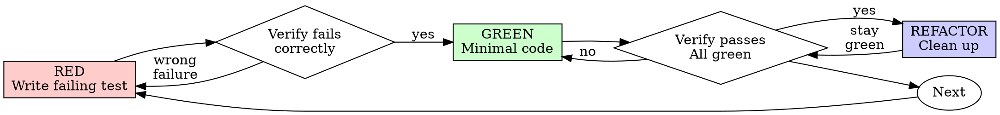

# Test-Driven Development (TDD)

## Overview

For behavior-heavy changes, write a focused test first, verify the test can detect the missing
behavior, implement the smallest change, and keep the resulting check as regression coverage.

**Core principle:** Evidence that a check distinguishes the old and new behavior is more valuable
than ritual order. A red-green cycle is preferred when the repository can run it cheaply.

## When to Use

Use test-first by default for new business behavior, externally visible contracts, and reproducible
defects. Use a lighter regression check or test-after approach when the change is documentation,
configuration, styling, generated output, mechanical renaming, dependency metadata, or a tiny edit
whose behavior is already covered. Do not ask for permission to take the lighter path; record the
reason and run the most direct verification available.

## nzERP Test Location

When the working project is under `/opt/homebrew/var/www/yesgooo/nzERP/`, do not infer that a child repository should own a `tests/` directory. In particular, do **not** create `tests/`, `test/`, PHPUnit, or Pest files under `service/`, `backend/`, or `base/` unless the user explicitly asks for repository-owned tests.

For Webman regression coverage in these projects, use the `webman-php` guidance and the existing local harness. Lasting local scripts belong at `/opt/homebrew/var/www/yesgooo/nzERP/local-tests/<project>/<feature-or-bug>_assert.php` (or an existing script there), outside the child Git repository. Print explicit `[PASS]` or `[FAIL]` output.

Do not confuse a useful test with a mandatory test file. If no stable test seam exists, use a
characterization check, focused script, static validation, or manual evidence and state the gap.

## Default Cycle

```
BEHAVIOR CHANGE → THE CHEAPEST REPEATABLE CHECK THAT CAN DISTINGUISH OLD FROM NEW
```

For a selected test-first task, preserve the red-green-refactor order. If exploration or a manual
prototype happened first, keep it as context, then add a check that would have failed before the
fix; do not delete useful work merely to satisfy ceremony.

## Red-Green-Refactor



### RED - Write Failing Test

Write one minimal test showing what should happen.

<Good>
```typescript
test('retries failed operations 3 times', async () => {
  let attempts = 0;
  const operation = () => {
    attempts++;
    if (attempts < 3) throw new Error('fail');
    return 'success';
  };

  const result = await retryOperation(operation);

  expect(result).toBe('success');
  expect(attempts).toBe(3);
});
```
Clear name, tests real behavior, one thing
</Good>

<Bad>
```typescript
test('retry works', async () => {
  const mock = jest.fn()
    .mockRejectedValueOnce(new Error())
    .mockRejectedValueOnce(new Error())
    .mockResolvedValueOnce('success');
  await retryOperation(mock);
  expect(mock).toHaveBeenCalledTimes(3);
});
```
Vague name, tests mock not code
</Bad>

**Requirements:**
- One behavior
- Clear name
- Real code (no mocks unless unavoidable)

### Verify RED - Watch It Fail

For a selected TDD cycle, run this check before implementation when the test runner supports it.

```bash
npm test path/to/test.test.ts
```

Confirm:
- Test fails (not errors)
- Failure message is expected
- Fails because feature missing (not typos)

**Test passes?** You're testing existing behavior. Fix test.

**Test errors?** Fix error, re-run until it fails correctly.

### GREEN - Minimal Code

Write simplest code to pass the test.

<Good>
```typescript
async function retryOperation<T>(fn: () => Promise<T>): Promise<T> {
  for (let i = 0; i < 3; i++) {
    try {
      return await fn();
    } catch (e) {
      if (i === 2) throw e;
    }
  }
  throw new Error('unreachable');
}
```
Just enough to pass
</Good>

<Bad>
```typescript
async function retryOperation<T>(
  fn: () => Promise<T>,
  options?: {
    maxRetries?: number;
    backoff?: 'linear' | 'exponential';
    onRetry?: (attempt: number) => void;
  }
): Promise<T> {
  // YAGNI
}
```
Over-engineered
</Bad>

Don't add features, refactor other code, or "improve" beyond the test.

### Verify GREEN - Watch It Pass

For a selected TDD cycle, run the focused check after implementation and expand to the relevant
regression suite in proportion to risk.

```bash
npm test path/to/test.test.ts
```

Confirm:
- Test passes
- Other tests still pass
- Output pristine (no errors, warnings)

**Test fails?** Fix code, not test.

**Other tests fail?** Fix now.

### REFACTOR - Clean Up

After green only:
- Remove duplication
- Improve names
- Extract helpers

Keep tests green. Don't add behavior.

### Repeat

Next failing test for next feature.

## Good Tests

| Quality | Good | Bad |
|---------|------|-----|
| **Minimal** | One thing. "and" in name? Split it. | `test('validates email and domain and whitespace')` |
| **Clear** | Name describes behavior | `test('test1')` |
| **Shows intent** | Demonstrates desired API | Obscures what code should do |

## Why Order Often Helps

**"I'll write tests after to verify it works"**

Tests written after code pass immediately. Passing immediately proves nothing:
- Might test wrong thing
- Might test implementation, not behavior
- Might miss edge cases you forgot
- You never saw it catch the bug

Test-first is strong evidence that the check observes the intended behavior. When a test-after
check is the more economical choice, make the expected behavior explicit and verify it against an
independent baseline where possible.

**"I already manually tested all the edge cases"**

Manual testing is ad-hoc. You think you tested everything but:
- No record of what you tested
- Can't re-run when code changes
- Easy to forget cases under pressure
- "It worked when I tried it" ≠ comprehensive

Automated tests are systematic. They run the same way every time.

**"Deleting X hours of work is wasteful"**

Sunk cost fallacy. The time is already gone. Your choice now:
- Delete and rewrite with TDD (X more hours, high confidence)
- Keep it and add tests after (30 min, low confidence, likely bugs)

The goal is trustworthy evidence, not deletion for its own sake. Preserve exploratory work when it
is useful, then add the smallest honest check that covers the risk.

**"TDD is dogmatic, being pragmatic means adapting"**

TDD IS pragmatic:
- Finds bugs before commit (faster than debugging after)
- Prevents regressions (tests catch breaks immediately)
- Documents behavior (tests show how to use code)
- Enables refactoring (change freely, tests catch breaks)

Adaptation is appropriate when the change is non-behavioral, the test seam is unavailable, or a
different verification method gives stronger evidence. Do not use that as an excuse to skip a
cheap regression check for a high-impact behavior change.

**"Tests after achieve the same goals - it's spirit not ritual"**

No. Tests-after answer "What does this do?" Tests-first answer "What should this do?"

Tests-after are biased by your implementation. You test what you built, not what's required. You verify remembered edge cases, not discovered ones.

Tests-first force edge case discovery before implementing. Tests-after verify you remembered everything (you didn't).

Test-after is not TDD, but it can still be responsible engineering when its scope and limitations
are explicit. Prefer test-first where it materially improves confidence.

## Choosing the Verification Level

| Situation | Prefer |
|---|---|
| New business behavior or public contract | Test-first red-green-refactor |
| Reproducible high-impact defect | Failing regression test, then fix |
| Existing behavior with a fragile seam | Characterization test or focused script |
| Docs, config, styles, generated or mechanical edits | Direct lint/build/render/diff verification |
| No runnable test infrastructure | Smallest executable check available; report the limitation |

## Red Flags

- A behavior change has no repeatable check at all.
- The check asserts implementation details instead of user-visible behavior.
- A failing check is hidden, skipped, weakened, or replaced with a tautology.
- Verification is claimed from a single unrelated green command.
- A test-first exception is used to avoid a cheap high-value regression test.

These signal an evidence gap. Add or strengthen the smallest relevant check; do not delete working
code solely to reenact a workflow.

## Example: Bug Fix

**Bug:** Empty email accepted

**RED**
```typescript
test('rejects empty email', async () => {
  const result = await submitForm({ email: '' });
  expect(result.error).toBe('Email required');
});
```

**Verify RED**
```bash
$ npm test
FAIL: expected 'Email required', got undefined
```

**GREEN**
```typescript
function submitForm(data: FormData) {
  if (!data.email?.trim()) {
    return { error: 'Email required' };
  }
  // ...
}
```

**Verify GREEN**
```bash
$ npm test
PASS
```

**REFACTOR**
Extract validation for multiple fields if needed.

## Verification Checklist

Before marking work complete:

- [ ] Every new function/method has a test
- [ ] Watched each test fail before implementing
- [ ] Each test failed for expected reason (feature missing, not typo)
- [ ] Wrote minimal code to pass each test
- [ ] All tests pass
- [ ] Output pristine (no errors, warnings)
- [ ] Tests use real code (mocks only if unavoidable)
- [ ] Edge cases and errors covered

If a box does not apply, mark it not applicable and explain the chosen verification instead of
starting over automatically.

## When Stuck

| Problem | Solution |
|---------|----------|
| Don't know how to test | Write wished-for API. Write assertion first. Ask your human partner. |
| Test too complicated | Design too complicated. Simplify interface. |
| Must mock everything | Code too coupled. Use dependency injection. |
| Test setup huge | Extract helpers. Still complex? Simplify design. |

## Debugging Integration

For a reproducible behavior bug, write a failing regression test and follow the TDD cycle. For
environmental, visual, configuration, or one-off operational issues, use the strongest practical
evidence and state why a unit test is not the right artifact.

## Testing Anti-Patterns

When adding mocks or test utilities, read @testing-anti-patterns.md to avoid common pitfalls:
- Testing mock behavior instead of real behavior
- Adding test-only methods to production classes
- Mocking without understanding dependencies

## Final Rule

```
Behavior change → proportionate, repeatable evidence
Test-first when it materially improves confidence; lighter checks are valid for non-behavioral work.
```

Safety and verification claims still require evidence. No extra approval is needed to choose a
lighter workflow when the task is clearly low risk.
